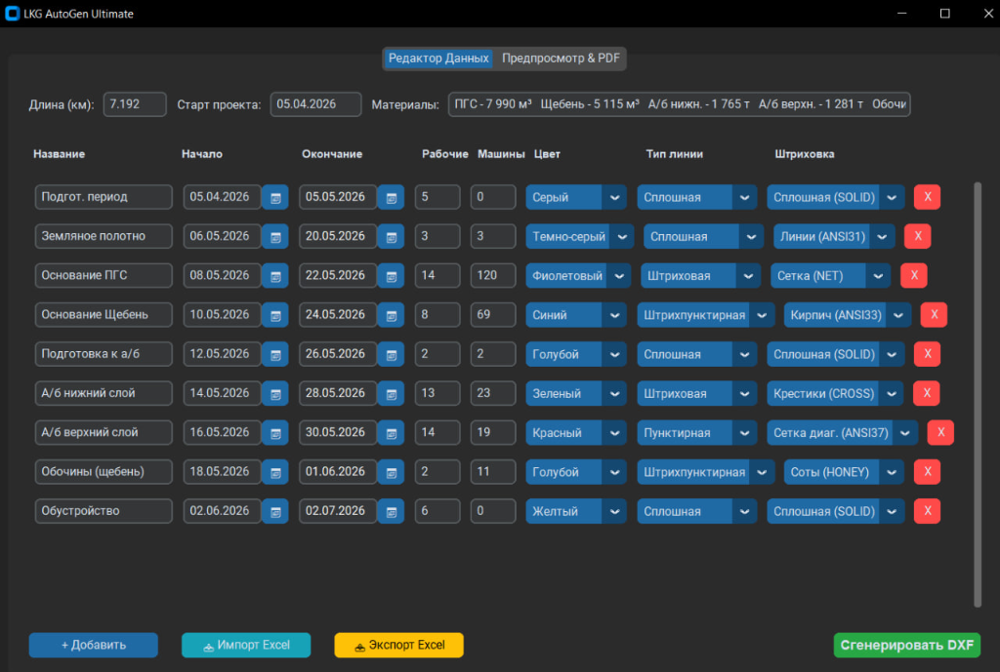
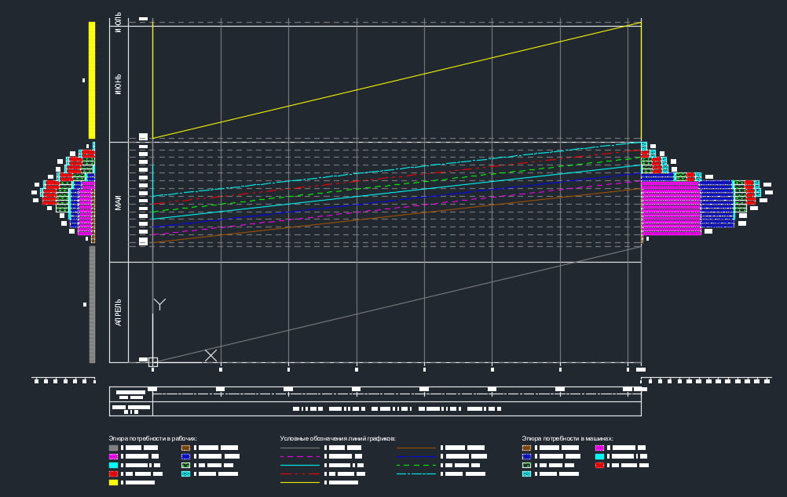

# CAD Construction Schedule DXF Generator 🏗️📐

[](https://www.python.org/)
[](LICENSE)
[](https://ezdxf.readthedocs.io/)

---

## English Version

### Interface & DXF Drawing Output

#### Application Interface (CustomTkinter GUI)


#### Generated CAD DXF Construction Schedule Output


---

### Description & Objectives
Engineering software module in Python designed to automate technological calculations and vector drawing generation of linear construction schedules in `.dxf` format (AutoCAD).

When designing transport construction objects and linear structures, drafting schedule charts manually requires significant time and carries risks of technical errors. This module automates the complete cycle: **Calculation of work volumes ➡️ Construction of staggered schedules ➡️ Export of production-ready vector documentation**.

### Key Features
- 🧮 **Automated Mathematical Calculation:** Calculation of labor intensity, required machinery/mechanisms, and stage durations.
- 📐 **DXF Drawing Generation:** Direct generation of schedule grids, coordinate axes, labels, hatchings, and symbols via `ezdxf`.
- 🎨 **Modern GUI Interface:** Window interface built with `customtkinter` with Dark/Light modes for convenient data input.
- 📊 **Excel Integration:** Import and export capabilities for work volume tables (`.xlsx`).

### Tech Stack
* **Language:** Python 3.10+
* **GUI:** `customtkinter`
* **CAD & Vector Graphics:** `ezdxf`
* **Mathematics:** `math`, `datetime`
* **Spreadsheet Processing:** `openpyxl` / `pandas`

### Repository Structure
```text
├── razdeldetal.py    # Main logic module, calculations, and DXF generation
├── assets/           # Interface screenshots and CAD output previews
│   ├── gui_preview.png
│   └── cad_preview.png
├── .gitignore        # Git ignore rules
├── LICENSE           # MIT License
└── README.md         # Documentation
```

### Quick Start
1. **Clone the repository:**
   ```bash
   git clone https://github.com/Bargaisl/lkg-generator.git
   cd lkg-generator
   ```
2. **Install dependencies:**
   ```bash
   pip install customtkinter ezdxf openpyxl
   ```
3. **Run application:**
   ```bash
   python razdeldetal.py
   ```

### ⚠️ Disclaimer & Precautions
This software is provided for educational and research purposes only. The authors and copyright holders assume no responsibility or liability for any errors, inaccuracies, structural miscalculations, or losses arising from the use of generated CAD drawings or data. Users are solely responsible for verifying all calculations before using them in real engineering projects.

### License
This project is licensed under the [MIT License](LICENSE).

---

## Русская версия (Russian Version)

### Интерфейс программы и пример сгенерированного чертежа

#### Графический интерфейс программы (CustomTkinter GUI)


#### Чертеж календарного графика в формате CAD DXF


---

### Описание и задачи проекта
Инженерный программный модуль на Python для автоматизации технологических расчетов и векторной генерации чертежей линейных календарных графиков строительства в формате `.dxf` (AutoCAD).

При проектировании объектов транспортного строительства и линейных сооружений составление календарных графиков вручную требует значительных временных затрат и подвержено риску технических ошибок. Данный модуль решает задачу автоматизации цикла: **расчет объемов работ ➡️ построение эшелонированного графика ➡️ экспорт готовой векторной документации**.

### Ключевой функционал
- 🧮 **Автоматизированный математический расчет:** Вычисление трудоемкости, потребного количества машин/механизмов и продолжительности этапов строительства.
- 📐 **Генерация DXF-чертежей:** Прямое построение сетки графиков, привязка координатных осей, нанесение подписей, штриховок и условных обозначений через низкоуровневые сущности `ezdxf`.
- 🎨 **Современный GUI-интерфейс:** Оконный интерфейс на `customtkinter` с темным/светлым режимами для комфортного ввода исходных данных.
- 📊 **Интеграция с Excel:** Поддержка импорта и экспорта табличных ведомостей объемов работ (`.xlsx`).

### Стек технологий
* **Язык программирования:** Python 3.10+
* **Графический интерфейс (GUI):** `customtkinter`
* **Работа с САПР & DXF:** `ezdxf`
* **Математический аппарат:** `math`, `datetime`
* **Обработка электронных таблиц:** `openpyxl` / `pandas`

### Структура репозитория
```text
├── razdeldetal.py    # Основной модуль логики, расчетов и генерации DXF
├── assets/           # Скриншоты интерфейса и примеры чертежей CAD
│   ├── gui_preview.png
│   └── cad_preview.png
├── .gitignore        # Исключения временных файлов и сборки
├── LICENSE           # Лицензия MIT
└── README.md         # Техническая документация проекта
```

### Быстрый запуск
1. **Клонируйте репозиторий:**
   ```bash
   git clone https://github.com/Bargaisl/lkg-generator.git
   cd lkg-generator
   ```
2. **Установите необходимые зависимости:**
   ```bash
   pip install customtkinter ezdxf openpyxl
   ```
3. **Запустите приложение:**
   ```bash
   python razdeldetal.py
   ```

### ⚠️ Предупреждение и отказ от ответственности
Данное программное обеспечение предоставляется исключительно в учебных и исследовательских целях. Авторы и правообладатели не несут никакой ответственности за возможные ошибки, неточности, ошибки в расчетах или убытки, возникшие в результате использования сгенерированных чертежей САПР или данных. Пользователи несут полную ответственность за проверку всех расчетов перед их применением в реальных инженерных проектах.

### Лицензия
Проект распространяется под лицензией [MIT License](LICENSE).
